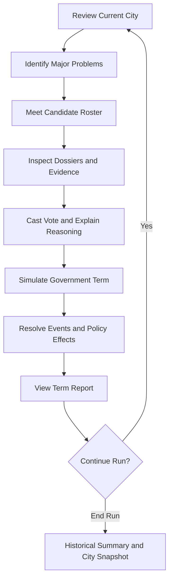

# Resibo, Please
## Comprehensive Project Context and Development Specification

> **Working public title:** Resibo, Please  
> **Formal capstone title:** *Resibo, Please: An AI-Assisted Mobile Civic Decision Simulation Game for Voter Literacy and SDG-Based Decision-Making*  
> **Primary platform:** Android mobile  
> **Development/testing platform:** Flutter Web in Chrome during early development  
> **Frontend:** Flutter  
> **Game layer:** Flame, used only where a real-time canvas or animated city scene is beneficial  
> **Planned backend:** Firebase  
> **Primary SDG:** SDG 4 — Quality Education  
> **Secondary SDG:** SDG 11 — Sustainable Cities and Communities  
> **Related scenario domains:** SDG 1, 2, 3, 6, 8, and 13

---

# 1. Document Purpose

This file is the main project context for developers, designers, researchers, and AI coding assistants working on **Resibo, Please**.

It defines:

- the problem the project is solving;
- the intended player experience;
- the core and long-term game loops;
- the simulation rules;
- how candidates, city problems, evidence, events, and consequences work;
- what AI is and is not allowed to do;
- the asynchronous multiplayer system;
- all major screens and features;
- required data structures;
- recommended Flutter project architecture;
- assets required;
- the MVP scope and future roadmap;
- testing and research goals;
- content safety and political neutrality requirements.

When implementation decisions conflict with this document, update this file first so it remains the single source of truth.

---

# 2. Project Summary

**Resibo, Please** is a fictional political decision simulation game.

The player becomes a voter responsible for the long-term direction of a fictional city. Before each election, the player must inspect candidate dossiers, campaign promises, public records, news reports, debate answers, endorsements, controversies, fact-checks, and the current condition of the city.

The player then casts a vote without being shown which candidate is considered the “best” or what percentage match each candidate has.

The elected candidate governs for a simulated term. Their abilities, integrity, platform, execution skill, hidden risks, the city’s existing problems, available budget, and random events determine how the city changes.

The city persists across multiple elections. Good and bad decisions accumulate. A player may continue the same run through several administrations until they voluntarily end the simulation or the city reaches a terminal failure state.

At the end of a run, the player receives a historical report showing:

- every election;
- every elected candidate;
- the condition of the city before and after each term;
- major events and policy outcomes;
- recurring voter tendencies;
- evidence habits;
- misinformation resistance;
- strengths and weaknesses in decision-making;
- the final state of the city.

Players may publish a safe snapshot of their fictional city. Other players can visit it asynchronously, inspect its history, see its current condition, and view an in-game voter profile based only on decisions made inside the simulation.

The game does **not** endorse real politicians, analyze real candidates, or tell users how to vote in actual elections.

---

# 3. The Core Problem

The project does not assume that voters simply lack information.

The deeper problems are:

1. **Information overload**  
   Voters may receive many claims, posts, speeches, promises, scandals, and opinions without a clear process for evaluating them.

2. **Unequal evidence quality**  
   A viral post, campaign advertisement, investigative report, public record, and anonymous allegation do not deserve equal trust.

3. **Popularity and familiarity bias**  
   A voter may favor a famous name, family name, celebrity, attractive presentation, emotional speech, or repeated slogan over qualifications and feasibility.

4. **Short-term thinking**  
   Election decisions may be based on immediate promises without considering budget, implementation, long-term effects, or tradeoffs.

5. **Disconnected policy understanding**  
   Poverty, hunger, health, education, water, employment, urban development, and climate risks affect one another.

6. **No safe practice environment**  
   Traditional voter education commonly relies on articles, lectures, videos, infographics, or quizzes. These explain concepts but rarely let users experience the consequences of repeated decisions.

**Resibo, Please** addresses these problems through a safe fictional simulation in which the player investigates, chooses, experiences consequences, reflects, and tries again.

---

# 4. Project Goals

## 4.1 General Objective

To develop an AI-assisted mobile civic decision simulation game that improves voter literacy, critical evaluation of evidence, misinformation resistance, and awareness of SDG-related community problems.

## 4.2 Specific Objectives

1. Create a fictional city simulation whose condition persists across multiple election cycles.
2. Present candidates through dossiers containing both useful evidence and misleading or incomplete information.
3. Require players to evaluate candidates without revealing a pre-election match percentage or correct answer.
4. Simulate the consequences of elected leadership using transparent, deterministic rules with controlled randomness.
5. Use AI to create varied fictional narratives and adaptive feedback without allowing AI to decide the true game state.
6. Measure player behavior such as evidence usage, issue prioritization, misinformation resistance, and recurring bias patterns.
7. Allow players to publish and visit asynchronous city snapshots.
8. Evaluate learning improvement through pre-test, gameplay analytics, post-test, and usability testing.

---

# 5. Target Users

## Primary users

- Senior high school students
- College students
- First-time or young voters
- Civic education learners

## Secondary users

- Teachers
- Social studies instructors
- Voter education organizations
- Researchers studying decision behavior
- General mobile game players interested in political simulation

## Suggested initial testing group

College students aged 18 and above, since they are easier to recruit for capstone testing and may already be eligible voters.

The visual style may be playful, but the language and decisions should not feel childish.

---

# 6. SDG Alignment

## 6.1 Primary: SDG 4 — Quality Education

The game supports SDG 4 through:

- civic education;
- critical thinking;
- media and information literacy;
- evidence evaluation;
- understanding policy tradeoffs;
- reflective decision-making;
- pre-test and post-test learning assessment.

## 6.2 Secondary: SDG 11 — Sustainable Cities and Communities

The city simulation focuses on local governance and community conditions such as:

- housing;
- transport;
- disaster resilience;
- health services;
- education access;
- water systems;
- employment;
- public trust;
- climate adaptation;
- community stability.

## 6.3 Related scenario domains

The simulation may generate problems connected to:

- **SDG 1:** poverty and inequality;
- **SDG 2:** hunger and food security;
- **SDG 3:** health services and public health;
- **SDG 6:** clean water and sanitation;
- **SDG 8:** jobs, wages, and working conditions;
- **SDG 13:** climate risk and disaster preparedness.

The game should not claim that every individual scenario equally addresses every SDG. Each scenario has primary and secondary issue tags.

---

# 7. Design Principles

## 7.1 The player must think independently

Never display:

- candidate accuracy percentages;
- “best candidate” labels;
- hidden candidate scores;
- green/red recommendation badges;
- AI voting recommendations;
- pre-election outcome predictions presented as certainty.

The player can compare facts, but the interface must not tell them whom to choose.

## 7.2 There should rarely be a perfect candidate

Candidates should involve tradeoffs:

- competent but ethically questionable;
- honest but inexperienced;
- strong on urgent problems but weak elsewhere;
- charismatic with unrealistic promises;
- technically qualified but poor at coalition building;
- popular and effective in one area but risky in another.

## 7.3 Outcomes must be understandable after the vote

After a term, the game should explain why changes happened:

- candidate policy strength;
- implementation capability;
- integrity;
- budget;
- city conditions;
- random external events;
- choices made during the term.

The system must not simply say, “You chose incorrectly.”

## 7.4 AI creates variety, not truth

The simulation engine determines facts and outcomes. AI may turn those facts into readable stories, speeches, articles, reactions, and feedback.

> **Algorithm creates truth. AI creates presentation.**

## 7.5 The game should remain playable without AI

Every critical game system must have:

- template-based content;
- local fallback text;
- deterministic generation;
- cached AI output where permitted.

AI service failure must not destroy saved runs.

## 7.6 Political neutrality is mandatory

The game must use:

- fictional cities;
- fictional candidates;
- fictional political parties;
- fictional events;
- fictional media organizations.

Do not imitate a living politician too closely in name, appearance, slogan, biography, or controversy.

## 7.7 Consequences accumulate

Every election should leave a lasting effect. The central fantasy is not one correct vote; it is building or damaging a city through a history of political choices.

---

# 8. Visual and Tonal Direction

## 8.1 Art direction

- Quirky 2D cartoon political satire
- Exaggerated but original candidate designs
- Bold outlines
- Simple shading
- Expressive poses and facial expressions
- Slightly strange old-Flash-game energy
- Modern, readable mobile interface
- Illustrated city scenes combined with clean information panels

## 8.2 UI balance

- **Game world:** colorful, expressive, satirical
- **Information UI:** structured, readable, clean
- **Dossiers:** paper, folders, tabs, stamps, clipped articles
- **Election screens:** dramatic but uncluttered
- **Results:** analytical, visual, and easy to interpret

## 8.3 Suggested palette

- Warm cream and beige for documents
- Dark navy for serious panels
- Muted red for warnings and election drama
- Teal for navigation and neutral highlights
- Gold for accomplishments and civic identity
- Purple for candidate identity or premium visual accents

## 8.4 Tone

- Clever
- Slightly ironic
- Playful
- Serious underneath the humor
- Never insulting toward voters
- Never directly partisan

## 8.5 Brand line ideas

- “Huwag basta maniwala. Hanapin ang resibo.”
- “Bawat boto, may bunga.”
- “Pangako ay madali. Resibo muna.”
- “Read. Question. Decide. Live with the result.”

---

# 9. Core Game Loop

The core loop repeats once per election cycle.



## 9.1 Step-by-step loop

### Step 1: Review the city

The player sees:

- current city condition;
- current year or term number;
- available budget;
- public trust;
- urgent problems;
- worsening trends;
- previous administration history.

### Step 2: Receive the election brief

The game introduces:

- position being contested;
- number of candidates;
- current political environment;
- major city concerns;
- special election modifiers.

Example:

> “The city is recovering from two consecutive floods. Food prices are rising, public trust is low, and the water system requires urgent repair.”

### Step 3: Investigate candidates

The player opens candidate dossiers and reviews available evidence.

Possible evidence categories:

- biography;
- education;
- work experience;
- public service history;
- platform;
- budget proposal;
- debate statements;
- campaign advertisements;
- endorsements;
- donations;
- allegations;
- verified controversies;
- social media posts;
- polling;
- independent reports;
- fact-checks;
- public records.

### Step 4: Manage limited attention

Optional but recommended game mechanic:

- Each election gives a limited number of **Investigation Points**, **Days**, or **Attention Tokens**.
- Reading a basic profile is free.
- Requesting deeper reports, fact-checks, financial records, or interviews costs time.
- The player cannot inspect everything.
- This creates meaningful information prioritization.

This system should be configurable. It can be disabled in tutorial mode.

### Step 5: Cast a vote

The player selects a candidate and optionally answers:

- Why did you choose this candidate?
- Which issue mattered most?
- Which evidence was most convincing?
- How confident are you?

No candidate match percentage should be displayed.

### Step 6: Simulate the term

The term may advance through:

- four quarters;
- twelve months;
- or a simplified sequence of four major phases.

The simulation applies:

- candidate leadership traits;
- policy strengths;
- integrity;
- execution;
- budget;
- city issue interactions;
- random events;
- mid-term player decisions where applicable.

### Step 7: Show consequences

The player sees:

- issue improvements;
- issue deterioration;
- budget changes;
- trust changes;
- scandals;
- achievements;
- failed promises;
- unexpected events;
- visual city changes.

### Step 8: Begin next election or end run

If continuing:

- the city state persists;
- new candidates are generated;
- old problems may worsen or disappear;
- new problems may emerge;
- previous administrations become part of historical evidence.

If ending:

- the player receives a full run report;
- the city may be published as a multiplayer snapshot.

---

# 10. Long-Term and Meta Game Loop


## Meta progression may include

- new city presets;
- harder scenario modifiers;
- alternate government positions;
- candidate archetype collections;
- dossier themes;
- city nameplates;
- profile badges;
- achievements;
- scenario difficulty levels;
- historical city archive.

Meta progression must never sell or reveal the “correct” candidate.

---

# 11. City Simulation Model

## 11.1 Primary city indicators

Every city has numeric indicators from `0` to `100`.

| Key | Meaning |
|---|---|
| `food_security` | Food access, hunger, affordability |
| `poverty_reduction` | Poverty level and support effectiveness |
| `public_health` | Health services, disease readiness, access |
| `education_quality` | School access, resources, completion |
| `water_security` | Clean water, sanitation, reliability |
| `employment_quality` | Jobs, wages, worker conditions |
| `urban_resilience` | Housing, transport, safety, disaster systems |
| `climate_resilience` | Flood, heat, typhoon, environmental readiness |

## 11.2 Supporting indicators

| Key | Meaning |
|---|---|
| `budget_health` | Available public funds and fiscal stability |
| `public_trust` | Confidence in institutions |
| `corruption_pressure` | Risk of misuse, patronage, or capture |
| `inequality` | Difference in outcomes across groups |
| `infrastructure_condition` | Physical systems and maintenance |
| `social_stability` | Protests, tension, cooperation |
| `population_satisfaction` | General citizen sentiment |

## 11.3 Indicator ranges

| Range | State |
|---|---|
| 0–19 | Critical |
| 20–39 | Poor |
| 40–59 | Unstable |
| 60–79 | Functional |
| 80–100 | Strong |

Do not overuse raw numbers in the player UI. Use descriptive labels, bars, icons, and trends. Raw values may be visible in developer mode.

## 11.4 City problems

A problem is not identical to an indicator.

Example:

- Indicator: `water_security = 31`
- Active problem: “Frequent contamination after floods”
- Severity: 84
- Urgency: 90
- Trend: worsening
- Related domains: water, health, climate
- Required policy traits: water policy, crisis response, infrastructure execution

### Problem data structure

```json
{
  "id": "problem_water_contamination",
  "title": "Post-Flood Water Contamination",
  "description": "Several districts report unsafe water after heavy flooding.",
  "primary_domain": "water_security",
  "related_domains": ["public_health", "climate_resilience"],
  "severity": 84,
  "urgency": 90,
  "trend": "worsening",
  "visibility": "high",
  "duration_terms": 1,
  "required_traits": {
    "water_policy": 0.35,
    "crisis_response": 0.25,
    "infrastructure_execution": 0.25,
    "integrity": 0.15
  }
}
```

## 11.5 Problem generation

Problems may come from:

1. city indicators below thresholds;
2. unresolved previous problems;
3. consequences of prior administrations;
4. event chains;
5. scenario presets;
6. controlled procedural generation.

A city should normally have:

- 2–3 urgent problems;
- 2–4 secondary problems;
- several stable areas.

Too many simultaneous critical problems will make every candidate feel useless.

---

# 12. Candidate Model

## 12.1 Hidden candidate attributes

These values are used by the simulation and are not directly shown to players.

| Attribute | Purpose |
|---|---|
| `general_competence` | Overall ability to understand and manage government |
| `implementation_skill` | Ability to turn plans into results |
| `integrity` | Resistance to corruption and patronage |
| `coalition_skill` | Ability to pass and coordinate policies |
| `crisis_response` | Performance during disasters and emergencies |
| `budget_discipline` | Ability to manage public funds |
| `communication` | Ability to gain support and explain policy |
| `adaptability` | Ability to respond when plans fail |
| `populism` | Preference for popular but possibly weak solutions |
| `corruption_risk` | Likelihood of scandals or resource leakage |
| `experience` | Familiarity with public administration |
| `ego` | Resistance to advice, compromise, or correction |

Each value ranges from `0` to `100`.

## 12.2 Policy domain abilities

Each candidate has values from `0` to `100` in:

- food policy;
- poverty policy;
- health policy;
- education policy;
- water policy;
- employment policy;
- urban development;
- climate policy.

## 12.3 Candidate archetypes

Archetypes are generation templates, not final personalities.

Examples:

- Popular reformer
- Experienced traditional politician
- Celebrity outsider
- Policy technocrat
- Local organizer
- Dynasty heir
- Business-backed executive
- Labor advocate
- Environmental specialist
- Charismatic populist
- Quiet administrator
- Anti-corruption prosecutor
- Crisis hero
- Opportunistic party-switcher

Every generated candidate should have at least:

- 2 meaningful strengths;
- 2 meaningful weaknesses;
- 1 uncertain or hidden risk;
- 1 issue where they appear strong but may lack execution;
- 1 issue where they may outperform expectations.

## 12.4 Visible candidate information

The player sees evidence-based representations rather than raw hidden attributes.

Example:

- “Strong public health experience”
- “No major infrastructure projects completed”
- “Budget plan lacks clear funding”
- “Maintains broad council support”
- “Linked to donors with construction interests”
- “High attendance in previous office”
- “Popular among young voters”
- “Multiple claims remain unverified”

## 12.5 Candidate generation pipeline

1. Select scenario and city seed.
2. Determine active city problems.
3. Select varied candidate archetypes.
4. Generate hidden attributes.
5. Apply strengths, weaknesses, and contradictions.
6. Generate platform priorities.
7. Generate evidence truth records.
8. Generate dossier items and misleading claims.
9. Use AI or templates to create readable fictional content.
10. Validate that no candidate is an obvious universal answer.

---

# 13. Candidate Suitability and Outcome Algorithm

The game may internally calculate a candidate’s suitability, but this must never be shown before the vote.

## 13.1 Issue weight

```text
issue_weight =
    normalized_severity
    × normalized_urgency
    × trend_multiplier
    × visibility_modifier
```

Suggested trend multipliers:

- improving: `0.8`
- stable: `1.0`
- worsening: `1.2`
- rapidly worsening: `1.4`

## 13.2 Candidate capacity for a problem

```text
problem_capacity =
    policy_domain_score × policy_weight
  + implementation_skill × implementation_weight
  + crisis_response × crisis_weight
  + integrity × integrity_weight
  + coalition_skill × coalition_weight
  + experience × experience_weight
```

Weights come from the problem definition.

## 13.3 Feasibility modifier

```text
feasibility_modifier =
    budget_fit
    × coalition_fit
    × infrastructure_readiness
    × time_horizon_fit
```

## 13.4 Integrity leakage

A candidate with high corruption risk may reduce effective policy impact.

```text
effective_budget =
    allocated_budget × (1 - corruption_leakage)
```

Corruption leakage must not always create an immediate scandal. Some effects may remain hidden until a later event or investigation.

## 13.5 Term impact

```text
term_impact =
    issue_weight
    × problem_capacity
    × feasibility_modifier
    × event_modifier
    × controlled_random_variation
```

The random variation should be seeded so the same saved game can be reproduced during debugging.

Suggested controlled random range:

```text
0.90 to 1.10
```

Major events may use larger modifiers but must be logged.

## 13.6 Avoid a simplistic “correct answer”

A candidate may be the best fit for one urgent issue but produce damage elsewhere.

Example:

- Candidate A solves unemployment but increases corruption and environmental risk.
- Candidate B improves long-term resilience but causes short-term economic pain.
- Candidate C is ethical and competent but lacks coalition support.
- Candidate D offers immediate relief but damages the budget.

The player should be evaluated on decision quality, not merely whether they selected the numerically highest candidate.

---

# 14. Evidence and Dossier System

## 14.1 Evidence types

- Official public record
- Independent audit
- Investigative article
- Opinion article
- Campaign advertisement
- Speech transcript
- Debate response
- Social media claim
- Anonymous allegation
- Endorsement
- Financial disclosure
- Donor record
- Performance report
- Fact-check
- Poll
- Citizen testimonial
- Expert analysis
- Leaked document
- Satirical content
- Corrected article

## 14.2 Evidence attributes

```json
{
  "id": "evidence_maya_budget_plan",
  "candidate_id": "candidate_maya",
  "type": "policy_document",
  "title": "Five-Year Housing Plan",
  "summary": "Promises 20,000 affordable housing units.",
  "truth_status": "partially_true",
  "reliability": 78,
  "bias_direction": "candidate_positive",
  "source_reputation": 67,
  "relevance_domains": ["urban_resilience", "poverty_reduction"],
  "investigation_cost": 1,
  "is_initially_visible": true,
  "contradicts_evidence_ids": ["evidence_maya_budget_gap"],
  "supports_hidden_facts": ["housing_policy_high", "budget_plan_weak"]
}
```

## 14.3 Truth statuses

- verified true
- mostly true
- partially true
- misleading
- unverified
- false
- manipulated
- satire
- outdated
- missing context

## 14.4 Reliability is not identical to truth

A reputable source may publish incomplete information.  
An unreliable source may accidentally contain a true fact.

The player should learn to inspect:

- source;
- evidence;
- context;
- date;
- conflicts;
- funding;
- wording.

## 14.5 Evidence discovery

Evidence may be:

- immediately visible;
- unlocked by spending investigation points;
- revealed after opening another file;
- revealed by contradiction;
- available only during debate;
- revealed after election;
- hidden until a scandal event.

## 14.6 No pre-election scoring hints

Remove:

- match percentages;
- candidate accuracy;
- recommended labels;
- “best for city” badges;
- green highlighting around a preferred candidate.

Allowed:

- factual summaries;
- issue tags;
- evidence count;
- source categories;
- investigation completeness;
- player-created notes;
- side-by-side comparison with no recommendation.

---

# 15. Election System

## 15.1 Election setup

Recommended initial election:

- one position: Mayor;
- three candidates for MVP;
- four candidates for full version;
- one election per simulated term.

Future positions:

- Governor;
- Senator;
- President;
- Barangay Chairperson;
- School council leader;
- District representative.

## 15.2 Election phases

1. City briefing
2. Candidate introduction
3. Investigation
4. Debate or campaign phase
5. Final review
6. Vote
7. Reasoning input
8. Term simulation
9. Report

## 15.3 Player reasoning

The player may answer through:

- optional free-text explanation;
- selected top reason;
- selected most important issue;
- confidence slider;
- selected most trusted evidence.

The free-text explanation may be analyzed by AI later, but the game must still work if the player skips it.

## 15.4 Election result

In the initial version, the player’s candidate wins because the player is effectively choosing the administration for the simulation.

A future mode may simulate the wider electorate, where the player influences but does not fully control the outcome.

For the capstone MVP, direct selection is simpler and clearer.

---

# 16. Term Simulation

## 16.1 Term structure

Recommended term:

- 4 phases representing quarters or years;
- 1–2 major events per phase;
- one short report after each phase;
- one full report at term end.

## 16.2 What happens during a term

- Policies are selected from the candidate platform.
- Budget is allocated.
- Existing problems react.
- New events occur.
- Candidate traits influence implementation.
- Public trust changes.
- Scandals may emerge.
- Indicators change.
- City visuals update.

## 16.3 Player interaction during a term

Two possible designs:

### Option A: Mostly observational

The player watches the elected government act. This makes the vote itself the central decision.

### Option B: Limited civic decisions

The player may make a few non-government choices such as:

- support investigation;
- demand transparency;
- prioritize which report to follow;
- respond to misinformation;
- join a public consultation.

Recommendation: use **Option A for MVP** and add limited events later. Too many mid-term decisions may weaken the consequence of the original vote.

## 16.4 Promise tracking

Each candidate has 3–5 campaign promises.

At term end, each promise becomes:

- completed;
- partially completed;
- delayed;
- abandoned;
- contradicted;
- completed with negative side effects.

## 16.5 City visual changes

Examples:

- cleaner or dirtier streets;
- repaired or broken infrastructure;
- new clinic;
- school improvements;
- flood damage;
- abandoned buildings;
- protests;
- public celebrations;
- water tanks;
- public transport changes;
- greener or more polluted skyline.

For MVP, use layered illustrations rather than a fully simulated city.

---

# 17. Event System

## 17.1 Event categories

- Natural disaster
- Economic shock
- Public health crisis
- Infrastructure failure
- Labor dispute
- Corruption scandal
- Policy success
- Protest
- Budget shortage
- Donor pressure
- Media controversy
- Education disruption
- Water contamination
- Housing crisis
- Climate event
- National policy effect
- Unexpected opportunity

## 17.2 Event triggers

Events may be triggered by:

- city indicators;
- candidate traits;
- corruption risk;
- unresolved problems;
- previous events;
- random chance;
- scenario presets;
- player history.

## 17.3 Event chains

Example:

```text
Heavy rainfall
→ drainage failure
→ neighborhood flooding
→ water contamination
→ clinic overload
→ trust decline
```

A strong climate policy may reduce the probability or severity of the chain.

## 17.4 Event data structure

```json
{
  "id": "event_major_flood",
  "title": "Severe Flooding Hits Three Districts",
  "trigger_conditions": {
    "climate_resilience_below": 45,
    "urban_resilience_below": 50
  },
  "base_probability": 0.18,
  "effects": {
    "urban_resilience": -8,
    "water_security": -6,
    "public_health": -4,
    "budget_health": -5,
    "public_trust": -3
  },
  "candidate_response_traits": [
    "crisis_response",
    "water_policy",
    "implementation_skill"
  ],
  "narrative_template_id": "major_flood_v1"
}
```

---

# 18. AI System

## 18.1 AI responsibilities

AI may generate:

- fictional candidate names and biographies;
- speeches;
- debate answers;
- campaign ads;
- fictional news articles;
- social media posts;
- citizen reactions;
- event narration;
- term summaries;
- reflective player feedback;
- varied wording for existing structured facts.

## 18.2 AI must not

- choose the correct candidate;
- modify hidden game state without validation;
- create real-person endorsements;
- generate direct advice about real elections;
- present fabricated real news;
- decide whether the player is a “good” or “bad” voter;
- generate unrestricted political propaganda;
- create defamatory content about real people;
- override the simulation algorithm.

## 18.3 Structured generation

AI responses should use JSON schemas.

Example candidate narrative request:

```json
{
  "task": "render_candidate_dossier",
  "world_rules": {
    "fictional_only": true,
    "country_inspiration": "generic Southeast Asian democracy",
    "avoid_real_person_similarity": true
  },
  "candidate_truth": {
    "archetype": "popular_reformer",
    "strengths": ["health_policy", "communication"],
    "weaknesses": ["budget_discipline", "experience"],
    "risk": "donor_dependency",
    "platform": ["public clinics", "school meals", "housing"]
  },
  "output_style": "satirical but respectful",
  "reading_level": "college"
}
```

Expected response:

```json
{
  "display_name": "Maya Vargas",
  "short_bio": "...",
  "campaign_slogan": "...",
  "speech_excerpt": "...",
  "dossier_summary": "...",
  "warning": null
}
```

## 18.4 Validation

Before saving AI content:

1. Validate JSON format.
2. Check required keys.
3. Reject references to real politicians or parties.
4. Reject impossible numerical claims.
5. Ensure output matches hidden game truth.
6. Cache the accepted result.
7. Fall back to templates on failure.

## 18.5 AI feedback on player reasoning

The AI may identify patterns such as:

- focused on one issue only;
- relied heavily on popularity;
- ignored feasibility;
- considered multiple sources;
- resisted misinformation;
- overtrusted one source;
- recognized tradeoffs.

Feedback must be phrased as reflective, not authoritative.

Bad:

> “You voted for the wrong candidate.”

Better:

> “Your explanation focused on the candidate’s popularity and employment promise, but it did not mention the funding gap revealed in the budget report.”

---

# 19. Player Decision Analytics

## 19.1 Metrics

Possible metrics:

- Evidence breadth
- Source diversity
- Fact-check usage
- Misinformation resistance
- Issue prioritization
- Feasibility awareness
- Track-record awareness
- Integrity awareness
- Long-term thinking
- Confidence calibration
- Decision consistency
- Adaptability across runs

## 19.2 Metrics should not be shown as candidate hints

Analytics are calculated after voting or at the end of a run.

## 19.3 Example calculation

```text
evidence_breadth =
    unique_evidence_categories_viewed
    / available_relevant_categories

source_diversity =
    unique_source_types_viewed
    / target_source_type_count

misinformation_resistance =
    misleading_items_rejected
    / misleading_items_encountered
```

## 19.4 Voter archetype

At the end of a run, the player may receive a neutral in-game profile.

Examples:

- Evidence Seeker
- Risk-Averse Planner
- Crisis-First Voter
- Idealistic Reformer
- Economic Pragmatist
- Integrity-First Voter
- Charisma-Susceptible
- Single-Issue Voter
- Long-Term Builder
- Contrarian Investigator

Avoid insulting labels. Profiles should describe in-game tendencies only.

---

# 20. Run Ending Conditions

## 20.1 Voluntary ending

The player may end the simulation after a completed term.

## 20.2 Suggested minimum

Require at least 3 election cycles before a full voter profile is generated.

## 20.3 Terminal city states

Optional hard endings:

- Institutional collapse
- Unsustainable debt
- Public trust crisis
- Severe social instability
- Repeated public health failure
- Critical infrastructure collapse

Avoid framing city collapse as punishment for one vote. It should emerge from accumulated conditions.

## 20.4 Positive milestone endings

Optional:

- Resilient city
- Trusted institutions
- Strong social outcomes
- Sustainable economy
- Balanced development

The city should never become permanently perfect. New problems can always emerge.

---

# 21. End-of-Run Historical Report

The final report should include:

## 21.1 Timeline

- Election 1
- Candidate elected
- Initial city problems
- Major policies
- Major events
- Final term results

Repeat for every term.

## 21.2 City trend charts

- All core city indicators over time
- Public trust
- Budget health
- Corruption pressure
- Satisfaction

## 21.3 Voting history

- Candidate selected
- Stated reason
- Most reviewed evidence
- Confidence
- Immediate result
- Long-term result

## 21.4 Player behavior summary

- Evidence categories commonly used
- Evidence categories commonly ignored
- Trusted source patterns
- Susceptibility to misleading content
- Primary issue priorities
- Changes in decision strategy

## 21.5 Reflection

Use a short AI-generated or template-based summary.

Example:

> “Across four elections, you consistently prioritized public health and education. Your strongest decisions occurred when you reviewed budget feasibility and independent audits. You were less cautious when candidates used emotionally persuasive disaster messaging.”

---

# 22. Asynchronous Multiplayer: City Visits

## 22.1 Purpose

Players can visit another player’s fictional city and see how that player’s voting history shaped it.

This supports:

- comparison;
- social discussion;
- replay motivation;
- shareability;
- profile identity;
- possible viral growth.

## 22.2 This is not real-time multiplayer

The system stores and loads a public city snapshot.

No live movement, sockets, network physics, or simultaneous play is required.

## 22.3 Public city snapshot

```json
{
  "snapshot_id": "city_public_abc123",
  "owner_public_name": "Kaz",
  "city_name": "Bayhaven",
  "current_term": 5,
  "city_grade": "B-",
  "city_indicators": {
    "food_security": 66,
    "public_health": 74,
    "education_quality": 70,
    "water_security": 51,
    "employment_quality": 62,
    "urban_resilience": 59,
    "climate_resilience": 47
  },
  "administration_history": [
    {
      "term": 1,
      "candidate_name": "Maya Vargas",
      "archetype": "popular_reformer",
      "major_result": "Expanded clinics but weakened budget health."
    }
  ],
  "voter_profile": {
    "label": "Evidence Seeker",
    "description": "Frequently checks records and independent reports."
  },
  "city_visual_state_id": "bayhaven_state_05",
  "published_at": "server_timestamp"
}
```

## 22.4 Visit features

Visitors may see:

- city visual;
- city name;
- owner display name;
- current city condition;
- government history;
- major achievements;
- major failures;
- voter archetype;
- selected public statistics;
- end-of-run badge.

Optional interactions:

- leave a predefined reaction;
- bookmark city;
- share visit code;
- compare city trends;
- challenge the same scenario seed.

## 22.5 Privacy

Do not expose:

- real political opinions;
- free-text explanations by default;
- email address;
- exact age;
- real location;
- private account data.

The voter profile is based only on fictional gameplay.

## 22.6 Multiplayer modes for future versions

- Same-seed city challenge
- Friends-only city access
- Weekly community scenario
- Anonymous city gallery
- City comparison
- Community statistics with opt-in aggregation

---

# 23. Major Screens and Pages

## 23.1 Splash Screen

Purpose:

- logo;
- loading;
- version check;
- save restoration.

## 23.2 Onboarding

Explain:

- fictional nature;
- no real political endorsement;
- core gameplay;
- evidence system;
- consequence system;
- privacy.

## 23.3 Login / Guest Mode

Options:

- Play as guest
- Email login
- Google login
- Link guest progress later

MVP may begin with guest/local mode.

## 23.4 Main Menu

Actions:

- Continue City
- Start New City
- Visit Cities
- Run History
- Profile
- Settings
- How to Play

## 23.5 New Run Setup

Options:

- city name;
- scenario preset;
- difficulty;
- random seed;
- tutorial mode;
- AI narration on/off;
- investigation limit on/off.

## 23.6 City Overview

Shows:

- illustrated city;
- term number;
- government status;
- urgent problems;
- key indicators;
- budget health;
- public trust;
- history button;
- begin election button.

## 23.7 City Problems Screen

Shows each problem with:

- severity;
- trend;
- affected districts;
- related SDGs;
- short explanation;
- historical cause.

Do not show which candidate solves it best.

## 23.8 Election Brief

Shows:

- office being elected;
- city context;
- number of candidates;
- available investigation points;
- election timeline.

## 23.9 Candidate Roster

Shows:

- portraits;
- names;
- party;
- slogan;
- basic biography;
- no match percentages.

## 23.10 Candidate Dossier

Tabs:

- Overview
- Biography
- Platform
- Track Record
- Financial Records
- News
- Debate
- Fact Checks
- Controversies
- Endorsements
- Player Notes

## 23.11 Evidence Reader

Shows:

- source;
- date;
- author or organization;
- content;
- reliability cues;
- linked contradictions;
- add note;
- bookmark;
- request fact-check.

## 23.12 Candidate Comparison

Allows the player to pin 2–4 candidates and compare:

- platform topics;
- qualifications;
- track records;
- unresolved red flags;
- promises;
- evidence viewed.

No recommendation or score.

## 23.13 Debate Screen

Options:

- scripted dialogue;
- AI-generated response from structured facts;
- player-selected questions;
- contradiction highlighting after investigation.

## 23.14 Election Day

Shows:

- candidate list;
- investigation completeness;
- city problem reminder;
- vote button;
- optional reasoning;
- confirmation dialog.

No accuracy percentage.

## 23.15 Term Simulation Screen

Shows:

- animated city;
- current phase;
- policy announcements;
- newspaper cards;
- city reactions;
- event transitions.

## 23.16 Event Detail

Shows:

- what happened;
- cause;
- immediate impact;
- administration response;
- related city indicators.

## 23.17 Term Report

Shows:

- improvements;
- worsening areas;
- completed promises;
- failed promises;
- scandals;
- budget;
- trust;
- candidate performance explanation.

## 23.18 Continue or End Run

Options:

- Continue to Next Election
- Review History
- Publish Snapshot
- End Run

## 23.19 Final Run Summary

Shows:

- election timeline;
- city chart;
- voter profile;
- evidence habits;
- strongest and weakest decisions;
- AI reflection;
- shareable card.

## 23.20 City Visit Browser

Features:

- enter city code;
- friends;
- recent visits;
- featured cities;
- same-seed challenge.

## 23.21 Public City Profile

Shows public city snapshot and history.

## 23.22 Player Profile

Shows:

- display name;
- completed runs;
- voter archetypes earned;
- achievements;
- published cities;
- scenario completion;
- optional cosmetics.

## 23.23 Settings

- music;
- sound effects;
- text size;
- animation intensity;
- AI narration;
- data privacy;
- account;
- accessibility;
- language.

## 23.24 Admin / Developer Console

Not shown to ordinary players.

Functions:

- inspect hidden candidate stats;
- set seed;
- force events;
- edit city indicators;
- test evidence;
- verify AI JSON;
- replay term;
- compare expected and actual simulation;
- export run data.

---

# 24. MVP Scope

The MVP must prove the complete core loop with limited content.

## MVP content

- 1 fictional city
- 1 election position: Mayor
- 3 candidates
- 3 urgent city problems
- 8 city indicators
- 20–30 evidence items
- 1 election
- 1 simulated term
- 4 term phases
- 4–6 events
- 1 term report
- 1 local run summary
- 1 publishable city snapshot
- 1 city visit page
- template-generated narrative
- optional AI summary only after deterministic systems work

## MVP screens

1. Splash
2. Main Menu
3. City Overview
4. City Problems
5. Candidate Roster
6. Candidate Dossier
7. Evidence Reader
8. Candidate Comparison
9. Election Day
10. Term Simulation
11. Term Report
12. Final Summary
13. Public City Visit

## MVP success condition

A tester can:

1. launch the game;
2. inspect the city;
3. investigate three candidates;
4. vote with no recommendation shown;
5. watch the term resolve;
6. understand why the city changed;
7. view a summary;
8. publish and visit a city snapshot.

---

# 25. Full Version Scope

After the MVP:

- multiple elections in one persistent city;
- multiple candidate archetypes;
- procedural candidate generation;
- AI-generated fictional articles and speeches;
- voter behavior analytics;
- multiple scenario seeds;
- asynchronous city browser;
- account system;
- achievements;
- adaptive difficulty;
- same-seed challenges;
- richer animated city;
- bilingual English/Filipino content;
- teacher/research dashboard;
- pre-test and post-test modules.

---

# 26. Non-Goals

Do not build these during the initial capstone version:

- real candidate comparison;
- real election prediction;
- real news scraping;
- political endorsements;
- real-time multiplayer;
- 3D open-world city;
- unrestricted free-form AI;
- custom AI model training;
- live voice debate;
- nationwide election database;
- blockchain voting;
- real digital ballots;
- political advertising platform;
- public social feed with unrestricted comments;
- complex economy comparable to a full city-building game.

---

# 27. Recommended Technical Stack

## 27.1 Core

- Flutter
- Dart
- Flame

## 27.2 State management

Recommended:

- `flutter_riverpod`

Use providers for:

- current run;
- current city;
- election state;
- dossier state;
- save status;
- authentication;
- multiplayer snapshots.

## 27.3 Navigation

Recommended:

- `go_router`

## 27.4 Data models

Recommended:

- immutable Dart classes;
- `json_serializable`;
- optionally `freezed` after the team is comfortable.

Avoid manually passing untyped maps throughout the application.

## 27.5 Local persistence

MVP options:

- `shared_preferences` for settings only;
- `hive_ce` or `isar` for structured local runs.

Recommended initial choice:

- Hive CE for local save data.

## 27.6 Backend

Planned Firebase services:

- Firebase Authentication
- Cloud Firestore
- Cloud Functions
- Cloud Storage
- Firebase App Check
- Firebase Analytics, optional
- Firebase Crashlytics, later

## 27.7 Charts

- `fl_chart`

## 27.8 Utilities

- `intl`
- `uuid`
- `collection`

## 27.9 Audio

- Flame Audio or `audioplayers`, added later.

Do not install every package immediately. Add packages only when the feature is implemented.

---

# 28. Flutter and Flame Responsibility Split

## Flutter handles

- menus;
- dossiers;
- text-heavy content;
- forms;
- comparisons;
- charts;
- player profile;
- city browser;
- settings;
- authentication;
- overlays;
- responsive layout.

## Flame handles

- animated city scene;
- background movement;
- citizens;
- weather;
- particles;
- election confetti;
- visual damage and repair;
- interactive map hotspots;
- scene transitions.

Do not build the entire application inside Flame.

A typical screen may use:

```text
Flutter Scaffold
└── Stack
    ├── Flame GameWidget
    └── Flutter UI overlay
```

---

# 29. Recommended Project Architecture

```text
lib/
├── app/
│   ├── app.dart
│   ├── router.dart
│   ├── theme/
│   └── bootstrap/
├── core/
│   ├── constants/
│   ├── errors/
│   ├── extensions/
│   ├── utils/
│   ├── widgets/
│   └── services/
├── domain/
│   ├── models/
│   │   ├── city.dart
│   │   ├── city_problem.dart
│   │   ├── candidate.dart
│   │   ├── evidence.dart
│   │   ├── election.dart
│   │   ├── term.dart
│   │   ├── event.dart
│   │   ├── player_profile.dart
│   │   └── city_snapshot.dart
│   ├── repositories/
│   └── simulation/
│       ├── city_engine.dart
│       ├── candidate_generator.dart
│       ├── event_engine.dart
│       ├── election_engine.dart
│       ├── analytics_engine.dart
│       └── seed_manager.dart
├── data/
│   ├── local/
│   ├── remote/
│   ├── repositories/
│   ├── seed_content/
│   └── dto/
├── features/
│   ├── onboarding/
│   ├── home/
│   ├── city/
│   ├── election/
│   ├── dossier/
│   ├── simulation/
│   ├── results/
│   ├── multiplayer/
│   ├── profile/
│   └── settings/
├── game/
│   ├── city_game.dart
│   ├── components/
│   ├── scenes/
│   ├── effects/
│   └── overlays/
├── ai/
│   ├── ai_service.dart
│   ├── prompt_templates/
│   ├── schemas/
│   ├── validators/
│   └── fallback_templates/
└── main.dart
```

---

# 30. Coding Rules for Codex and Developers

1. Use null-safe Dart.
2. Avoid placing game logic inside widgets.
3. Keep simulation deterministic when a seed is provided.
4. Keep hidden truth separate from displayed dossier content.
5. Do not expose hidden candidate scores to player-facing widgets.
6. Use domain models instead of raw maps.
7. Write unit tests for every simulation formula.
8. Use repository interfaces so local storage can later be replaced by Firebase.
9. Every AI response must pass schema validation.
10. Always provide fallback content when AI fails.
11. Do not hardcode real politician names, parties, slogans, or scandals.
12. Use fictional examples in sample data.
13. Keep UI responsive for narrow mobile screens and web testing.
14. Prefer small reusable widgets over giant page files.
15. Add comments to explain non-obvious simulation rules, not obvious UI code.
16. Never modify save data without versioning.
17. Add `schema_version` to saved runs.
18. Store a `seed` for every run and generated election.
19. Never calculate multiplayer public data on the client if it affects trust or ranking.
20. Avoid adding dependencies without documenting why.

---

# 31. Save Data Model

## Root run save

```json
{
  "schema_version": 1,
  "run_id": "run_abc123",
  "seed": 5839201,
  "created_at": "2026-07-17T12:00:00Z",
  "updated_at": "2026-07-17T14:00:00Z",
  "status": "active",
  "city": {},
  "current_term": 2,
  "election_history": [],
  "term_history": [],
  "player_analytics": {},
  "settings": {
    "ai_narration_enabled": true,
    "investigation_limit_enabled": true
  }
}
```

## Versioning

When models change:

- increment `schema_version`;
- write a migration function;
- never silently discard user saves.

---

# 32. Seeded Randomness

Every run receives a seed.

The seed controls:

- candidate generation;
- candidate hidden stats;
- evidence truth;
- event order;
- controlled outcome variation;
- city visuals.

Benefits:

- reproducible bugs;
- same-seed multiplayer challenges;
- fair comparison;
- stable testing;
- easier research validation.

AI wording may differ, but the underlying structured facts must remain tied to the seed.

---

# 33. Content and Asset Requirements

## 33.1 Candidate assets

For each candidate:

- full portrait;
- small roster portrait;
- neutral expression;
- campaign expression;
- concerned expression;
- scandal expression, optional;
- party icon;
- campaign color;
- signature or stamp.

## 33.2 City assets

- base skyline;
- city hall;
- residential area;
- school;
- clinic;
- water facility;
- business district;
- roads;
- drainage;
- park;
- evacuation center;
- damage overlays;
- improvement overlays;
- protest crowd;
- celebration crowd;
- weather layers.

## 33.3 Dossier assets

- folder backgrounds;
- paper cards;
- tabs;
- stamps;
- paper clips;
- redaction strips;
- newspaper templates;
- social post templates;
- fact-check labels;
- warning icons;
- source icons;
- bookmark icons.

## 33.4 Election assets

- ballot box;
- voting booth;
- campaign posters;
- microphones;
- debate stage;
- crowd silhouettes;
- confetti;
- banners;
- city seal.

## 33.5 Icons

- all city indicators;
- trend arrows;
- severity;
- reliability;
- evidence type;
- warning;
- verified;
- unverified;
- contradiction;
- budget;
- trust;
- corruption;
- profile archetypes.

## 33.6 Audio

- main menu theme;
- dossier paper sounds;
- stamp sound;
- page flip;
- election tension loop;
- vote confirmation;
- city improvement sound;
- negative event sound;
- report reveal;
- ambient city noise.

Audio is not required for the earliest MVP.

## 33.7 Fonts

Use open and redistributable fonts with:

- bold cartoon display font for title;
- clean sans-serif for body text;
- optional typewriter or newspaper font for dossier details.

Do not use copyrighted commercial fonts without a license.

---

# 34. Accessibility

Include:

- scalable text;
- strong color contrast;
- icons plus text, not color alone;
- reduced motion mode;
- subtitle support;
- screen-reader labels for major controls;
- readable evidence cards;
- no required rapid reaction gameplay;
- alternative text for visual city outcomes.

The game should be playable even if the user cannot distinguish red and green.

---

# 35. Research and Evaluation Plan

## 35.1 Suggested research question

Can a fictional, AI-assisted civic decision simulation improve voter literacy, evidence evaluation, and misinformation resistance among students?

## 35.2 Pre-test and post-test

Measure:

- source evaluation;
- promise feasibility recognition;
- misinformation identification;
- awareness of policy tradeoffs;
- confidence calibration;
- candidate evaluation reasoning.

## 35.3 Gameplay analytics

Collect with consent:

- evidence opened;
- source categories used;
- candidate selected;
- stated reason;
- misinformation interactions;
- confidence;
- city outcomes;
- replay behavior.

## 35.4 Usability

Use an accepted usability questionnaire such as:

- System Usability Scale;
- custom game engagement questionnaire;
- task completion testing.

## 35.5 Functional testing

- unit tests;
- integration tests;
- simulation reproducibility tests;
- AI schema tests;
- save migration tests;
- multiplayer privacy tests.

---

# 36. Security and Safety

1. Keep AI API keys off the client.
2. Call AI through a backend function.
3. Use App Check and rate limits.
4. Validate all generated JSON.
5. Sanitize free-text input.
6. Do not publish free-text voting reasons by default.
7. Use display names rather than real names.
8. Restrict public city content to safe structured fields.
9. Add report/block tools if social interactions expand.
10. Clearly label all cities, candidates, parties, news, and events as fictional.
11. Include a disclaimer that the game is not official election guidance.
12. Do not use real political logos.
13. Avoid generating candidates visually similar to real people.
14. Do not allow AI to generate targeted persuasion based on user demographics.

---

# 37. Suggested Development Phases

## Phase 0: Foundation

- Flutter project
- Flame dependency
- Riverpod
- GoRouter
- theme
- basic folder structure
- Git repository
- web run configuration

## Phase 1: Static Prototype

- main menu
- city overview
- candidate roster
- dossier
- evidence reader
- election screen
- static results

No simulation and no AI yet.

## Phase 2: Deterministic Simulation

- city model
- candidate model
- problem model
- election engine
- term engine
- events
- seeded randomness
- unit tests

## Phase 3: Persistent Run

- multiple terms
- save/load
- history
- final report
- voter analytics

## Phase 4: City Visualization

- Flame city scene
- visual layers
- event effects
- improvement/damage transitions

## Phase 5: Asynchronous Multiplayer

- Firebase Auth
- Firestore snapshots
- visit code
- public city profile
- privacy controls

## Phase 6: AI

- backend AI calls
- schemas
- validation
- narrative generation
- player reasoning feedback
- cached output
- fallback templates

## Phase 7: Research Build

- pre-test
- post-test
- consent
- analytics export
- usability testing
- bug fixes
- Android build

---

# 38. First Vertical Slice

Before building the entire game, complete one polished vertical slice.

## Scenario

**City:** Bayhaven  
**Main problems:**

1. Post-flood water contamination
2. Rising unemployment
3. Overcrowded public clinics

## Candidates

### Candidate A: Maya Vargas

- Strong health policy
- Strong communication
- Weak budget discipline
- Donor dependency risk

### Candidate B: Julian Pratt

- Strong employment and business policy
- Strong execution
- Weak climate policy
- High corruption risk

### Candidate C: Victor Chen

- Strong integrity
- Strong water and infrastructure planning
- Weak communication
- Limited coalition support

## Required evidence

- profile
- platform
- one campaign ad
- one public record
- one budget document
- one misleading social post
- one fact-check
- one controversy
- one debate answer per candidate

## Expected output

- no candidate recommendation;
- vote;
- four-phase term;
- city change;
- understandable report;
- public snapshot.

This slice should prove the game is enjoyable before adding procedural generation.

---

# 39. Example First Run

## Initial city state

```json
{
  "food_security": 58,
  "poverty_reduction": 46,
  "public_health": 41,
  "education_quality": 62,
  "water_security": 35,
  "employment_quality": 39,
  "urban_resilience": 44,
  "climate_resilience": 32,
  "budget_health": 60,
  "public_trust": 48,
  "corruption_pressure": 42
}
```

## Active problems

- Water contamination
- Unemployment
- Clinic overload

## Election

The player investigates three candidates and votes.

## Term example

Quarter 1:
- Candidate launches main policy
- Budget changes
- public reaction

Quarter 2:
- Heavy rain event
- candidate response tested

Quarter 3:
- donor or coalition event
- implementation succeeds or stalls

Quarter 4:
- promise completion
- scandal or achievement
- final term report

## Possible result

The city may improve in water and health but lose budget stability, or gain employment while worsening corruption and climate resilience.

---

# 40. Open Design Decisions

These should be decided before full implementation:

1. Is the player purely a voter, or also a civic observer during the term?
2. Are investigation points always limited?
3. How many candidates per election?
4. How many elections make a typical full run?
5. Should a city have a hard failure ending?
6. How much raw numerical data should players see?
7. Should player reasoning be required or optional?
8. Should AI generation occur before gameplay or on demand?
9. Can users replay the same seed?
10. Are public city visits open, code-based, or friends-only?
11. Will the first release be English only or bilingual?
12. Will teachers have an admin dashboard?
13. Does the player choose a city preset or receive a random city?
14. Are candidate portraits pre-made, modular, or AI-generated?
15. How much of the city should Flame animate in the MVP?

Recommended initial answers:

- player is primarily a voter;
- investigation limit enabled except tutorial;
- three candidates in MVP;
- three elections minimum for full profile;
- hard collapse is optional and disabled in MVP;
- show descriptive indicators plus optional details;
- reasoning is optional;
- AI generation is cached and performed between screens;
- replayable seeds;
- code-based city visits;
- English first, Filipino later;
- no teacher dashboard in MVP;
- one fixed city scenario first;
- pre-made modular portraits;
- simple layered Flame city.

---

# 41. Immediate Next Tasks

1. Create the Flutter project using Android and Web platforms.
2. Add Flame.
3. Initialize Git.
4. Create this folder structure:
   - `app`
   - `core`
   - `domain`
   - `data`
   - `features`
   - `game`
   - `ai`
5. Create initial domain models:
   - City
   - CityIndicatorSet
   - CityProblem
   - Candidate
   - CandidatePolicySet
   - EvidenceItem
   - Election
   - TermResult
6. Implement seeded random utility.
7. Hardcode the Bayhaven vertical slice.
8. Build static versions of:
   - City Overview
   - Candidate Roster
   - Candidate Dossier
   - Election Day
   - Term Report
9. Write unit tests for the first candidate suitability and term effect calculations.
10. Do not add Firebase or AI until the local vertical slice works.

---

# 42. Definition of Done for the First Prototype

The first prototype is complete when:

- It runs in Chrome through Flutter.
- The user can start the Bayhaven scenario.
- The city displays three urgent problems.
- Three candidates have working dossiers.
- Evidence can be opened and bookmarked.
- No candidate match percentage appears.
- The user can cast one vote.
- The deterministic simulation resolves one term.
- The city indicators update.
- The report explains major changes.
- The run can be restarted using the same seed.
- Automated tests confirm repeatable results.

---

# 43. Final Product Identity

**Resibo, Please** should feel like:

> A strange, funny, and serious dossier-based political simulation where every promise, scandal, source, and vote leaves a trace on a living city.

The player fantasy is not:

> “Find the objectively correct politician.”

It is:

> “Investigate imperfect candidates, make a defensible decision with incomplete information, and live with the accumulated consequences.”

That distinction should guide every design, coding, and content decision in the project.
